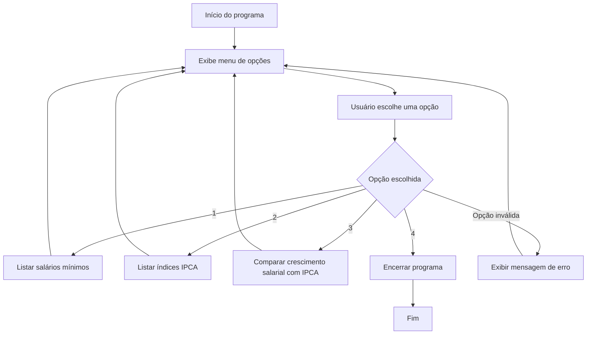
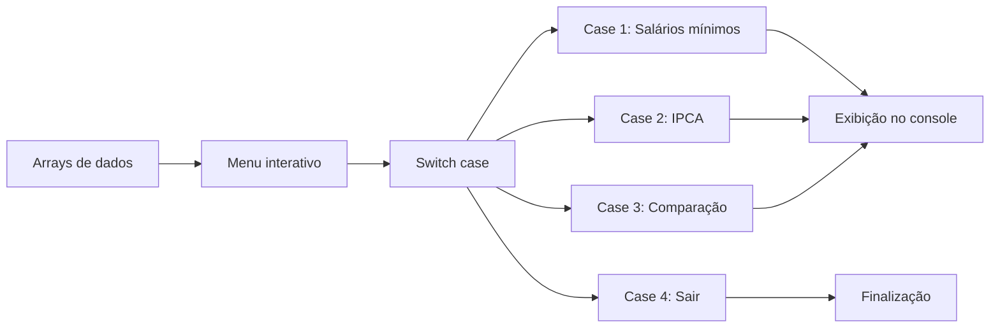

# Projeto: Salário Mínimo x IPCA

Este projeto é uma aplicação simples em **JavaScript com Node.js**, executada pelo terminal, que permite consultar os valores do salário mínimo brasileiro e os índices de inflação IPCA entre os anos de **2010 e 2026**.

Além da listagem dos dados, o sistema também compara o percentual de crescimento do salário mínimo com o IPCA de cada ano.

---

## Objetivo do projeto

O objetivo principal deste projeto é praticar conceitos fundamentais de JavaScript, como:

- Arrays de objetos;
- Estruturas de repetição;
- Estrutura condicional `switch`;
- Entrada de dados pelo terminal;
- Cálculo percentual;
- Formatação de valores monetários e percentuais;
- Organização de saída no console.

---

## Tecnologias utilizadas

| Tecnologia | Finalidade |
|---|---|
| JavaScript | Linguagem principal do projeto |
| Node.js | Ambiente de execução |
| readline-sync | Biblioteca para entrada de dados via terminal |
| VS Code | Editor de código utilizado no desenvolvimento |

---

## Estrutura geral do projeto

```txt
salario-inflacao/
│
├── salario.js
├── package.json
└── README.md
```

### Descrição dos arquivos

| Arquivo | Descrição |
|---|---|
| `salario.js` | Arquivo principal do projeto, contendo os dados, menu e cálculos |
| `package.json` | Arquivo de configuração do Node.js e dependências |
| `README.md` | Documentação do projeto |

---

## Como executar o projeto

### 1. Instale o Node.js

Verifique se o Node.js está instalado:

```bash
node -v
```

### 2. Instale a biblioteca readline-sync

Dentro da pasta do projeto, execute:

```bash
npm install readline-sync
```

### 3. Execute o projeto

```bash
node salario.js
```

---

## Funcionalidades do sistema

Ao executar o projeto, o usuário visualiza um menu com quatro opções:

```txt
Escolha uma das alternativas:
1 - Listar os salários mínimos de 2010 a 2026
2 - Listar índice IPCA de 2010 a 2026
3 - Comparação entre o percentual de aumento salarial e o IPCA
4 - Sair
```

---

## Fluxo de funcionamento



---

## Documento arquitetural de fluxo

### Visão geral

O projeto possui uma arquitetura simples, baseada em um único arquivo principal. Os dados são armazenados em arrays de objetos, e o usuário interage com o sistema por meio do terminal.

```txt
Usuário
  │
  ▼
Terminal
  │
  ▼
Menu principal
  │
  ├── Opção 1: Lista salários mínimos
  │
  ├── Opção 2: Lista IPCA
  │
  ├── Opção 3: Compara crescimento salarial x IPCA
  │
  └── Opção 4: Encerra o programa
```

---

## Arquitetura lógica



---

## Base de dados utilizada no código

O projeto utiliza dois arrays principais.

### Array de salários mínimos

```js
let salarios_minimos = [
  { ano: 2010, valor: 510.0 },
  { ano: 2011, valor: 545.0 },
  { ano: 2012, valor: 622.0 },
  { ano: 2013, valor: 678.0 },
  { ano: 2014, valor: 724.0 },
  { ano: 2015, valor: 780.0 },
  { ano: 2016, valor: 880.0 },
  { ano: 2017, valor: 937.0 },
  { ano: 2018, valor: 954.0 },
  { ano: 2019, valor: 998.0 },
  { ano: 2020, valor: 1045.0 },
  { ano: 2021, valor: 1100.0 },
  { ano: 2022, valor: 1212.0 },
  { ano: 2023, valor: 1320.0 },
  { ano: 2024, valor: 1412.0 },
  { ano: 2025, valor: 1518.0 },
  { ano: 2026, valor: 1621.0 },
];
```

### Array de IPCA

```js
let ipca_array = [
  { ano: 2010, valor: 5.91 },
  { ano: 2011, valor: 6.50 },
  { ano: 2012, valor: 5.84 },
  { ano: 2013, valor: 5.91 },
  { ano: 2014, valor: 6.41 },
  { ano: 2015, valor: 10.67 },
  { ano: 2016, valor: 6.29 },
  { ano: 2017, valor: 2.95 },
  { ano: 2018, valor: 3.75 },
  { ano: 2019, valor: 4.31 },
  { ano: 2020, valor: 4.52 },
  { ano: 2021, valor: 10.06 },
  { ano: 2022, valor: 5.79 },
  { ano: 2023, valor: 4.62 },
  { ano: 2024, valor: 4.83 },
  { ano: 2025, valor: 4.26 },
  { ano: 2026, valor: 4.72 },
];
```

> Observação: o valor de IPCA de 2026 pode ser alterado futuramente, pois o ano ainda pode não estar fechado dependendo da data de consulta.

---

## Prints simulados do código

### 1. Importação da biblioteca

```js
import entrada from "readline-sync";
```

Essa linha importa a biblioteca responsável por permitir que o usuário digite informações no terminal.

---

### 2. Menu principal

```js
console.log("Escolha uma das alternativas:");
console.log("1 - Listar os salários mínimos de 2010 a 2026");
console.log("2 - Listar índice IPCA de 2010 a 2026");
console.log("3 - Comparação entre o percentual de aumento salarial e o IPCA");
console.log("4 - Sair");

escolha = entrada.questionInt("\nDigite o número da alternativa escolhida: ");
```

Esse trecho exibe as opções disponíveis e recebe a escolha do usuário.

---

### 3. Estrutura switch

```js
switch (escolha) {
  case 1:
    // Lista os salários mínimos
    break;

  case 2:
    // Lista os índices IPCA
    break;

  case 3:
    // Compara crescimento salarial e IPCA
    break;

  case 4:
    // Encerra o programa
    break;

  default:
    // Trata opções inválidas
    break;
}
```

A estrutura `switch` direciona o programa para a funcionalidade escolhida pelo usuário.

---

### 4. Cálculo do crescimento salarial

```js
let salario_anterior = salarios_minimos[i - 1].valor;
let diferenca = salario - salario_anterior;

percentualCrescimento = (diferenca / salario_anterior) * 100;
crescimentoFormatado = percentualCrescimento.toFixed(2).replace(".", ",") + "%";
```

Esse trecho calcula o percentual de aumento do salário mínimo em relação ao ano anterior.

---

## Regra de cálculo utilizada

A fórmula usada para calcular o crescimento salarial é:

```txt
Percentual de crescimento = ((salário atual - salário anterior) / salário anterior) * 100
```

Exemplo:

```txt
Salário de 2011: R$ 545,00
Salário de 2010: R$ 510,00

Diferença = 545 - 510
Diferença = 35

Percentual = (35 / 510) * 100
Percentual = 6,86%
```

---

## Exemplo de saída no terminal

### Opção 1

```txt
>>> Salários mínimos de 2010 a 2026: <<<

Ano: ........................2010
Salário mínimo: ..............R$ 510,00

--------------------------------------------------
```

### Opção 2

```txt
>>> Índice IPCA de 2010 a 2026: <<<

Ano: ........................2010
Inflação IPCA: ...............5,91%

--------------------------------------------------
```

### Opção 3

```txt
>>> Comparação entre o percentual de aumento salarial e o IPCA: <<<

Ano: ........................2010
Salário mínimo: ..............R$ 510,00
Crescimento salarial: ........ -
Inflação IPCA: ...............5,91%

--------------------------------------------------

Ano: ........................2011
Salário mínimo: ..............R$ 545,00
Crescimento salarial: ........6,86%
Inflação IPCA: ...............6,50%

--------------------------------------------------
```

---

## Tratamento para o ano de 2010

No ano de 2010, o crescimento salarial aparece como `-`, pois não existe um ano anterior cadastrado no array para fazer a comparação.

```js
if (i > 0) {
  // calcula crescimento
} else {
  crescimentoFormatado = "-";
}
```

---

## Pontos positivos do projeto

- Código simples e funcional;
- Boa prática com arrays de objetos;
- Uso correto de `for...of` para listagens simples;
- Uso correto de `for` tradicional quando é necessário acessar o índice anterior;
- Menu interativo com repetição;
- Tratamento de opção inválida;
- Formatação visual da saída no terminal.

---

## Possíveis melhorias futuras

O projeto pode evoluir com algumas melhorias:

- Separar o código em funções;
- Criar um arquivo separado para os dados;
- Validar se os arrays possuem os mesmos anos;
- Exibir uma tabela final no terminal;
- Exportar os dados para CSV;
- Criar uma versão com interface web;
- Adicionar gráficos comparando salário mínimo e IPCA.

---

## Exemplo de organização futura

```txt
salario-inflacao/
│
├── src/
│   ├── dados/
│   │   ├── salarios.js
│   │   └── ipca.js
│   │
│   ├── funcoes/
│   │   ├── listarSalarios.js
│   │   ├── listarIpca.js
│   │   └── compararDados.js
│   │
│   └── index.js
│
├── package.json
└── README.md
```

---

## Conclusão

Este projeto demonstra de forma prática como usar JavaScript para manipular dados, criar menus interativos no terminal e realizar cálculos percentuais.

A aplicação é simples, mas possui uma boa base para evolução, principalmente para quem está aprendendo lógica de programação, arrays, objetos e estruturas de controle.
